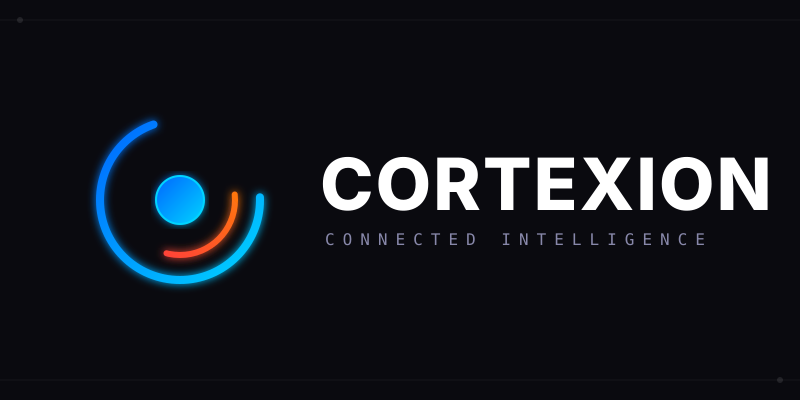
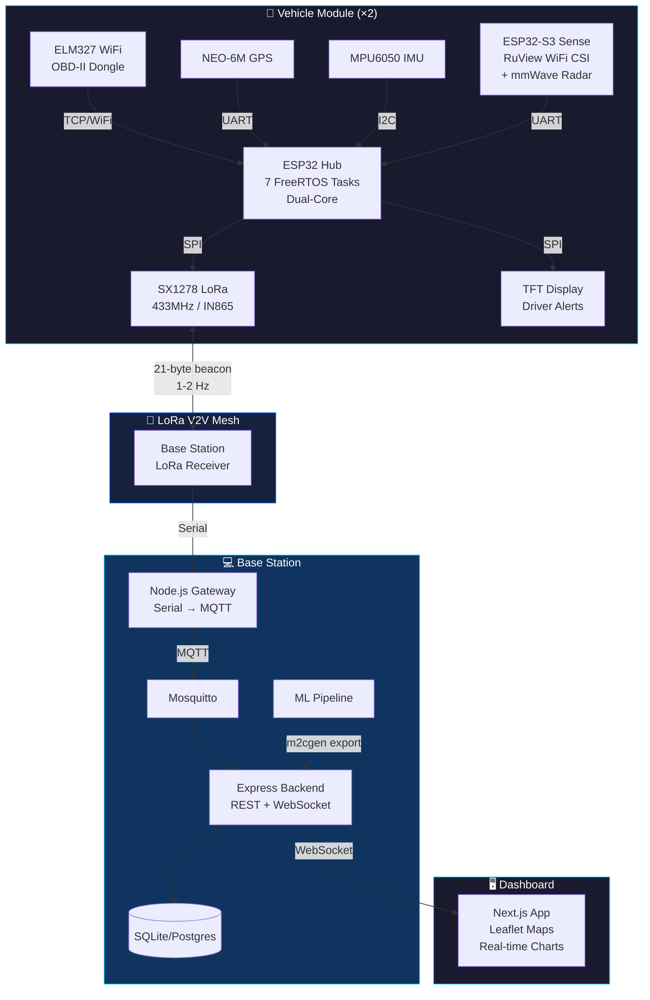
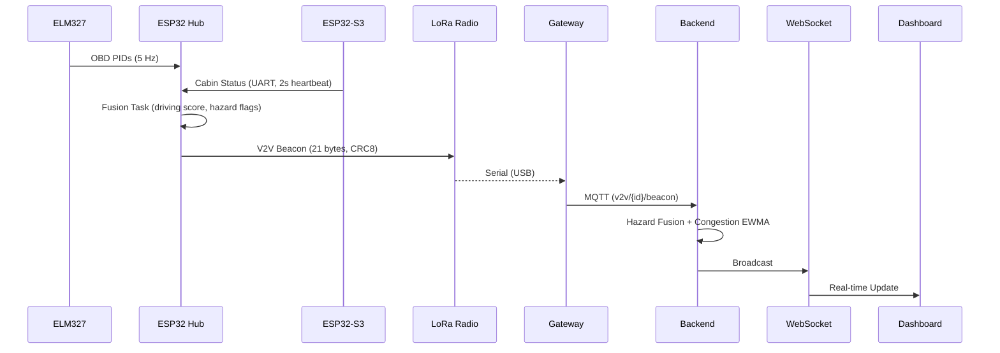

<div align="center">
  

  # CORTEXION

  ### Next-Generation Connected Vehicle Intelligence Platform

  **OBD-II Diagnostics • LoRa V2V Mesh • Camera-Free WiFi Sensing • mmWave Occupancy Sensing**

  *We gave the road a brain — without a single camera.*

  <p>
    <a href="https://github.com/Paramveersingh-S/vigilante/actions"></a>
    <a href="https://opensource.org/licenses/MIT"></a>
    
    
    
  </p>
</div>

---

## ⚡ What is Cortexion?

**Cortexion** (formerly RaahNetra) is a comprehensive, open-source hardware and software platform designed to retrofit conventional vehicles with modern V2V (Vehicle-to-Vehicle) communication and advanced telemetry. 

It turns every car into a smart, communicating node — using signals that **already exist in the vehicle**:

| Pillar | What It Does | Core Technology |
|--------|-------------|-----------------|
| 🔧 **Vehicle Intelligence** | Real-time engine diagnostics, driving behavior scoring, fuel-saving recommendations | ELM327 WiFi OBD-II + ESP32 |
| 📡 **V2V Safety Mesh** | Cars broadcast position, speed, and hazards directly to each other — no internet, no cloud | LoRa SX1278 point-to-point (433 MHz / IN865) |
| 👁️ **Camera-Free Cabin Sensing** | Detects driver presence, breathing patterns, and possible distress | ESP32-S3 + RuView WiFi CSI |
| 📡 **mmWave Occupancy Sensing** | Integrates Waveshare HMMD 24GHz mmWave radar for non-intrusive micro-motion distress monitoring | HMMD 24GHz mmWave Radar |

> **The unifying idea:** every signal already exists in the car — the OBD port, the WiFi radio, the road itself. Cortexion doesn't add cameras; it **listens better** to what's already there.

---

## 🏗️ System Architecture

Cortexion is built across four major layers:



### Data Flow



---

## 📦 Project Structure

```text
cortexion/
├── firmware/
│   ├── hub/              # ESP32 Hub — 7 FreeRTOS tasks (OBD, GPS, IMU, Sense, Fusion, LoRa, Screen)
│   ├── sense/            # ESP32-S3 Sense — RuView CSI bridge + mmWave radar
│   └── common/           # Shared: V2V packet struct (21B), CRC8, segment ID
├── gateway/              # Node.js — Serial → MQTT bridge with CRC validation
├── backend/              # Express — REST API + WebSocket + SQLite + hazard fusion
├── web/                  # Next.js — Live dashboard, analytics, sensing radar
├── ml/
│   ├── train_event_severity.py     # GBM: driving event severity (scikit-learn)
│   ├── train_cabin_wellness.py     # Transfer learning on RuView embeddings (PyTorch)
│   ├── congestion_estimator.py     # EWMA per road segment (deliberately not ML)
│   ├── hazard_fusion.py            # Rule engine with auditable reasons (deliberately not ML)
│   └── export_model.py             # m2cgen: sklearn → zero-dep JavaScript
├── simulator/            # Hardware-free testing (packet generator + TCP emitter)
├── docs/                 # Architecture, wire protocol, regulatory, ML design
└── docker-compose.yml    # Full stack: Mosquitto + Gateway + Backend + Web
```

---

## 🔬 ML Architecture — Honest Engineering

Not everything should be ML. This is the most important design decision in the project:

| Problem | Tool | Why |
|---------|------|-----|
| Instant harsh-brake alert | **Deterministic threshold** (firmware) | Zero latency, zero network dependency |
| Event severity for dashboard | **Gradient Boosting** (scikit-learn) | Enough signal to generalize past noise; non-safety-critical |
| Road congestion from 2 vehicles | **EWMA estimator** (not ML) | 2 data points per segment isn't a dataset |
| Cabin wellness/distress | **Transfer learning** (PyTorch) | Fine-tune on frozen RuView embeddings |
| Overall hazard level | **Rule engine** (not ML) | No ground truth for collisions; must be auditable |

> The model export pipeline uses `m2cgen` to compile the trained GBM into a **zero-dependency JavaScript function** — no Python service, no ONNX runtime, no deployment complexity for a 150-tree model.

---

## 🚀 Quick Start (Simulation Mode)

You can run the entire software stack without physical hardware using the built-in LoRa packet simulator.

### Option 1: Docker Compose (Recommended)

```bash
git clone https://github.com/Paramveersingh-S/vigilante.git
cd vigilante
docker-compose up -d

# Run the simulator to inject test data
cd simulator && python serial_emitter.py --scenario two_vehicle_approach --loop

# Open dashboard
open http://localhost:3000
```

### Option 2: Manual Setup

```bash
# Prerequisites: Node.js 20+, Python 3.11+, PlatformIO 6+

# 1. Install dependencies
cd gateway && npm install
cd ../backend && npm install
cd ../web && npm install
cd ../ml && pip install -r requirements.txt

# 2. Start MQTT broker
docker run -d -p 1883:1883 eclipse-mosquitto:2

# 3. Start services (in separate terminals)
cd gateway && npm run dev          # LoRa → MQTT bridge
cd backend && npm run dev          # REST + WebSocket API
cd web && npm run dev              # Dashboard at :3000

# 4. Generate synthetic data and train models
cd ml && python generate_synthetic_data.py
cd ml && python train_event_severity.py
cd ml && python train_cabin_wellness.py
cd ml && python export_model.py    # Export GBM → JavaScript

# 5. Run simulator
cd simulator && python serial_emitter.py --scenario normal_drive --loop
```

---

## 🛠️ Hardware Setup

For full deployment instructions for flashing the ESP32 Hub and Sense nodes, refer to the [Setup Guide](docs/setup-guide.md).

```bash
# Flash Hub firmware (ESP32 WROOM-32)
cd firmware/hub
cp ../common/config_template.h ../common/config.h  # Edit with your settings
pio run -t upload

# Flash Sense firmware (ESP32-S3)
cd firmware/sense
pio run -t upload
```

### Bill of Materials (India pricing)

| Item | Purpose | Price (₹) |
|------|---------|-----------|
| ESP32 LoRa32 (SX1278, OLED) | Hub + LoRa + status screen | 900–1,400 |
| ESP32-S3 DevKit | RuView CSI sensing | 450–700 |
| ELM327 WiFi OBD-II | Engine diagnostics | 500–900 |
| NEO-6M GPS | Vehicle positioning | 350–500 |
| TFT Display (2.4"–2.8") | Driver-facing alerts | 350–600 |
| MPU6050 IMU | Independent braking detection | 100–150 |
| Waveshare HMMD 24GHz | mmWave radar | 1,800–2,200 |
| **Per-vehicle total** | | **~₹4,900–7,000** |

---

## 📡 Wire Protocol

The V2V beacon is a **21-byte** binary packet broadcast over LoRa:

```
Offset  Size  Field              Encoding
0       1     proto_version      uint8 (0x01)
1       2     vehicle_id         uint16_le
3       4     lat_e6             int32_le (lat × 1,000,000)
7       4     lon_e6             int32_le (lon × 1,000,000)
11      1     speed_kmh          uint8
12      1     heading_div2       uint8 (degrees / 2)
13      1     driving_score      uint8 (0–100)
14      1     hazard_flags       bitfield (brake, accel, fuel, fault, gps)
15      1     cabin_status       enum (none, ok, still, distress, unknown)
16      4     timestamp_ms       uint32_le
20      1     crc8               polynomial 0x07
```

See [docs/wire-protocol.md](docs/wire-protocol.md) for the full specification.

---

## 🔒 Security & Ethics

> **This is a research-grade prototype, not a certified safety system.**

- LoRa broadcasts are **unauthenticated** (optional HMAC available)
- Cabin sensing uses **WiFi signal disturbance only** — no camera, no microphone, no cloud
- All sensing is **local-only** — no raw data leaves the device
- **Explicit consent** required from anyone in the cabin during testing
- Real automotive ADAS requires **ISO 26262** certification — not attempted here

---

## 📻 Regulatory Compliance (India)

| Band | Status | Notes |
|------|--------|-------|
| **865–867 MHz (IN865)** | ✅ License-exempt | 1% duty cycle, 30 dBm cap |
| **433 MHz** | ✅ License-exempt | 10 mW e.r.p. limit |
| **915 MHz (US)** | ❌ Not legal in India | Most tutorials are US-based — don't follow them |
| **868 MHz (EU)** | ❌ Not legal in India | Most English LoRa guides are EU-authored |

Duty cycle is enforced **programmatically** via the `DutyCycleGuard` class in firmware.

---

## 🧪 Testing

```bash
# Firmware (PlatformIO native tests)
cd firmware/hub && pio test -e native

# Gateway
cd gateway && npm test

# Backend
cd backend && npm test

# ML Pipeline
cd ml && pytest tests/ -v

# Web (build check)
cd web && npm run build
```

---

## 🗺️ Roadmap

- [x] V2V beacon protocol with CRC8 and versioning
- [x] FreeRTOS dual-core firmware architecture
- [x] Adaptive LoRa spreading factor (SF7 moving / SF11 stationary)
- [x] Camera-free cabin sensing via WiFi CSI
- [x] Waveshare mmWave Occupancy radar integration
- [x] Hazard fusion with transparent reasoning
- [x] ML model export to zero-dependency JavaScript
- [x] Real-time web dashboard with live map and analytics
- [ ] LoRaWAN gateway support (TTN integration)
- [ ] ESP32 OTA firmware updates
- [ ] Mobile companion app (React Native)
- [ ] End-to-end encryption (AES-128 on LoRa packets)
- [ ] ISO 26262 compliance roadmap

---

## 🤝 Contributing

We welcome contributions from the community! See [CONTRIBUTING.md](CONTRIBUTING.md) for:

- Code standards for C++ (firmware), JavaScript (gateway/backend/web), and Python (ML)
- Commit message conventions
- Testing requirements
- PR process

---

## 📄 License

This project is licensed under the [MIT License](LICENSE).

---

<div align="center">
  **Built with 🧠 by [Paramveersingh-S](https://github.com/Paramveersingh-S)**
  <br/>
  *Every signal here — the OBD port, the WiFi radio, the road — already existed in the car. We just built the network between them.*
</div>
