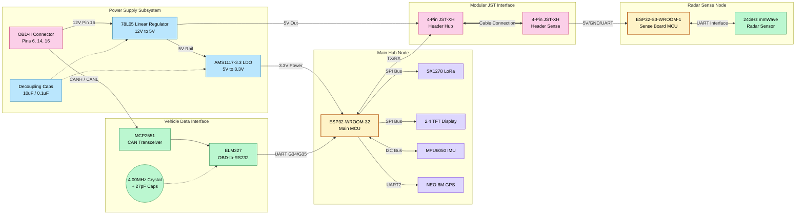

# Vehicle Telemetry Block Diagram

This block diagram represents the modular hardware system architecture, broken down into its functional subsystems.

```mermaid
flowchart LR
    %% Define Subgraphs
    subgraph Power["Power Supply Subsystem"]
        obd[OBD-II Connector<br/>Pins 6, 14, 16] -->|12V Pin 16| reg1[78L05 Linear Regulator<br/>12V to 5V]
        reg1 -->|5V Rail| reg2[AMS1117-3.3 LDO<br/>5V to 3.3V]
        caps[Decoupling Caps<br/>10uF / 0.1uF] -.-> reg1
        caps -.-> reg2
    end

    subgraph OBD["Vehicle Data Interface"]
        obd -->|CANH / CANL| mcp[MCP2551<br/>CAN Transceiver]
        mcp --> elm[ELM327<br/>OBD-to-RS232]
        xtal((4.00MHz Crystal<br/>+ 27pF Caps)) -.-> elm
    end

    subgraph Hub["Main Hub Node"]
        esp32[ESP32-WROOM-32<br/>Main MCU]
        reg2 -->|3.3V Power| esp32
        elm -->|UART G34/G35| esp32
        
        esp32 -->|SPI Bus| lora[SX1278 LoRa]
        esp32 -->|SPI Bus| tft[2.4 TFT Display]
        esp32 <-->|I2C Bus| imu[MPU6050 IMU]
        esp32 -->|UART2| gps[NEO-6M GPS]
    end

    subgraph Connection["Modular JST Interface"]
        hub_jst[4-Pin JST-XH<br/>Header Hub]
        sense_jst[4-Pin JST-XH<br/>Header Sense]
        
        reg1 -->|5V Out| hub_jst
        esp32 <-->|TX/RX| hub_jst
        
        hub_jst <==>|Cable Connection| sense_jst
    end

    subgraph Sense["Radar Sense Node"]
        esp32s3[ESP32-S3-WROOM-1<br/>Sense Board MCU]
        radar[24GHz mmWave<br/>Radar Sensor]
        
        sense_jst -->|5V/GND/UART| esp32s3
        esp32s3 <-->|UART Interface| radar
    end

    %% Apply styling
    classDef mcu fill:#fef3c7,stroke:#b45309,stroke-width:2px,color:#000;
    classDef power fill:#bae6fd,stroke:#0369a1,stroke-width:1px,color:#000;
    classDef obdic fill:#bbf7d0,stroke:#15803d,stroke-width:1px,color:#000;
    classDef sensor fill:#ddd6fe,stroke:#6d28d9,stroke-width:1px,color:#000;
    classDef conn fill:#fbcfe8,stroke:#be185d,stroke-width:1px,color:#000;

    class esp32,esp32s3 mcu;
    class reg1,reg2,caps power;
    class mcp,elm,xtal,radar obdic;
    class lora,tft,imu,gps sensor;
    class obd,hub_jst,sense_jst conn;
```
